# Write-up midterm

## Visualize Range Image Channels

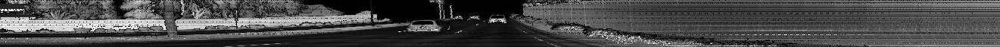

## Visualize Point-Cloud

10 images of vehicles with varying degrees of visability due to position, distance and occlusion:

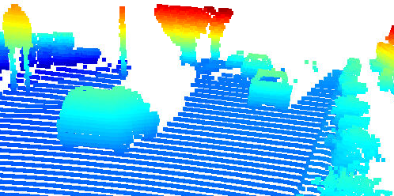
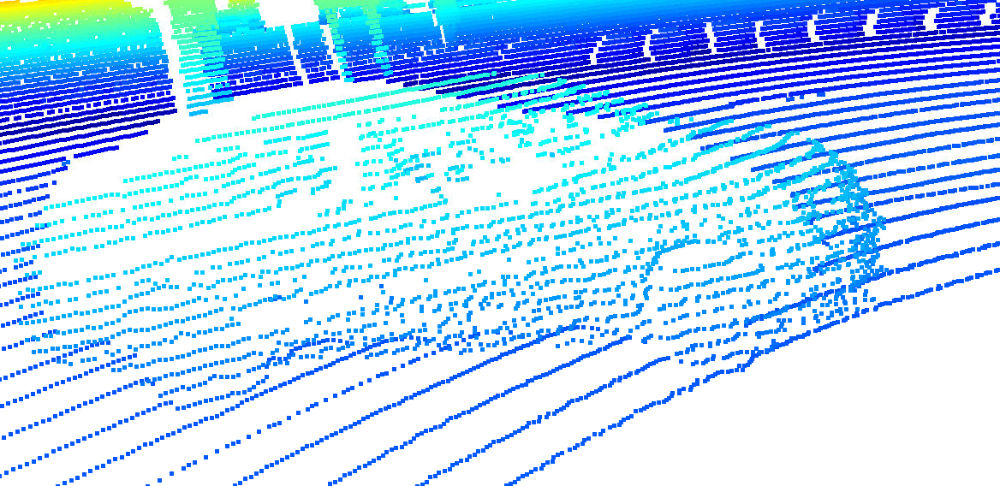
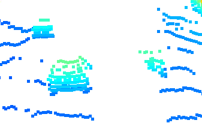
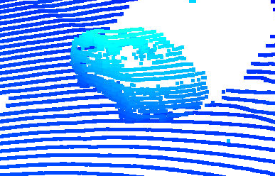
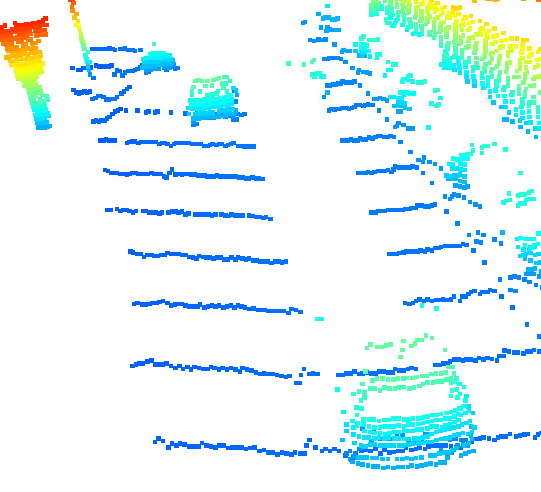
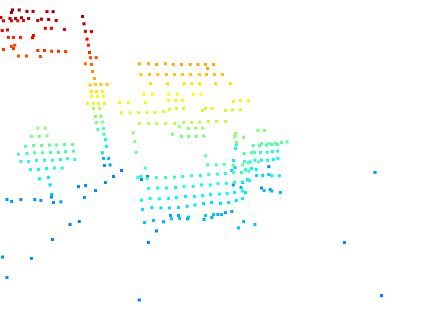
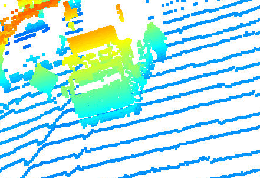
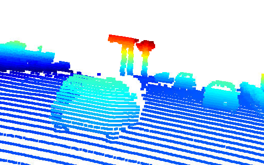
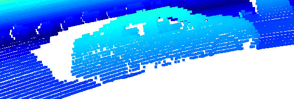
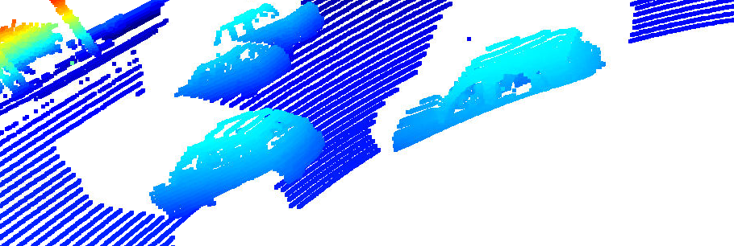

Vehicle features: 

| Feature | Description | Assessment |
|---------|-------------|------------|
| Side Mirrors | Appear both on trucks and cars as vertical or horizontal rectangles respectively | Visible until midrange, not reliable anymore if vehicle is too far away |
| Trapezoid shape of back of car | Car backs are typically wider at the bottom and narrower at the top | Visible even in far away cars |
| Back window | The back window appears as a rectangular hole in the point cloud | Visible even in far away cars, though sometimes not in very close ones as laser beams still get reflected on the short distance |
| Windscreen | Similar to back window, but with somewhat different shapes for trucks and cars | Visible even in far away vehicles, though sometimes not in very close ones as laser beams still get reflected on the short distance |
| Wheels | Appear from front and back as oval shapes where the top is occluded by the bumper, as a circle when seen from the side | Visible even in further away cars, appears different based on relative position |
| Car side profile | Cars have a distinct profile when seen from the side with a steeper back and a flatter front | Only seen when in 90 degree angle to other car |

## Visualize Bird's Eye View from Lidar PCL

## Visualize Height Layer of the BEV map

## Visualize Object Detection in BEV map with ResNet algorithm

## Visualize Performance Evaluation for Object Detection

